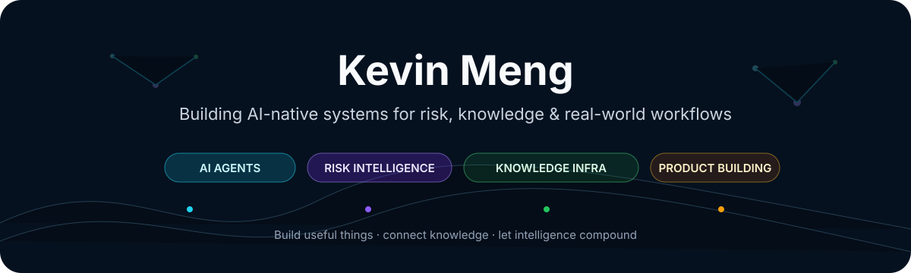
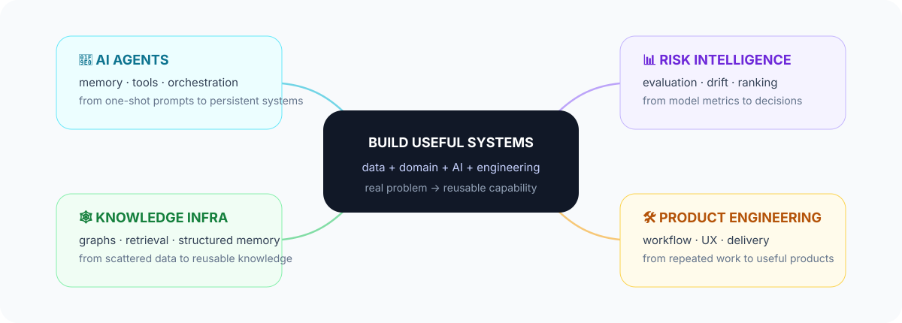

 

I build **AI-native systems** at the intersection of data, decision-making, knowledge, and product engineering.

I bring **10+ years of hands-on experience across financial risk, data mining, big-data engineering, and full-stack development**. That background shapes how I approach AI today: not as a layer of prompts, but as a system that has to work under real constraints — where data shifts, evaluation matters, memory matters, and products still need to fit human workflows.

  
  
  
  
  
  

[**🔭 Explore Projects**](https://github.com/kevin-meng?tab=repositories)

---

## 🧭 What I Build

I care about the layer **after the demo**: memory, evaluation, data quality, decision logic, workflow design, and the engineering required to make AI useful in practice.

---

## ⚙️ How I Work

**🔎 Real problem** → **🧪 Prototype** → **📊 Data & evaluation** → **🔁 Workflow** → **🛠️ Product** → **🧠 Reusable system**

 

| Principle | What it means |
| --- | --- |
| 🎯 **Real problem first** | Start from a workflow or decision that genuinely matters |
| 📐 **Evaluate before adding complexity** | Define evidence and success criteria before making the system smarter |
| 🧠 **AI for judgment, software for facts** | Keep deterministic logic deterministic; use AI where reasoning and language add value |
