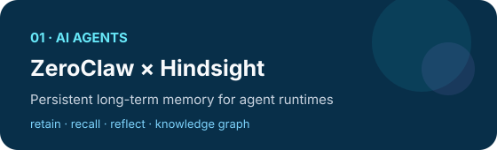
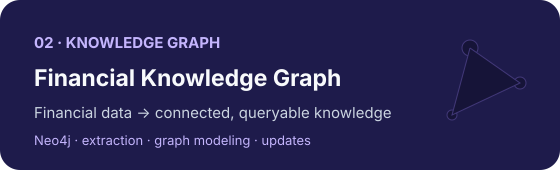
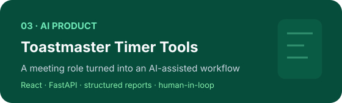
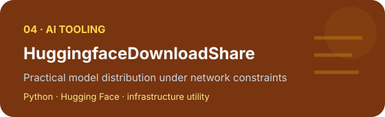

 

### 👋 Hi, I'm Kevin

I build **AI-native systems** that connect data, domain knowledge, decision-making, and real-world workflows.

  
  
  
  
  
  
  
  

[**🔭 Explore Projects**](https://github.com/kevin-meng?tab=repositories) · [**🌐 Personal Website**](https://kevin-meng.github.io)

---

## 🧭 What I Build

I care about the layer **after the demo**: memory, evaluation, data quality, decision logic, workflow design, and the engineering required to make AI useful in practice.

> 💡 **Useful > impressive. Systems > prompts. Evidence > intuition.**

---

## 🚀 Featured Open-source Work

<table>
<tr>
<td width="50%" valign="top">

### 🧠 [ZeroClaw × Hindsight](https://github.com/kevin-meng/zeroclaw-hindsight-v2)

Persistent long-term memory for AI agent runtimes, with explicit **retain / recall / reflect** operations.

`Rust` `Agents` `Memory` `Knowledge Graph`

</td>
<td width="50%" valign="top">

### 🕸️ [Financial Knowledge Graph](https://github.com/kevin-meng/financial_stock_knowledge_graph)

An end-to-end path from financial data extraction to graph modeling, Neo4j applications, and incremental updates.

`Python` `Neo4j` `FinTech` `Knowledge Graph`

</td>
</tr>
<tr>
<td width="50%" valign="top">

### 🛠️ [Toastmaster Timer Tools](https://github.com/kevin-meng/toastmaster_tools)

A real-world meeting role turned into a structured, AI-assisted workflow with human review.

`React` `TypeScript` `FastAPI` `PostgreSQL`

</td>
<td width="50%" valign="top">

### ⚡ [HuggingfaceDownloadShare](https://github.com/kevin-meng/HuggingfaceDownloadShare)

Practical AI infrastructure tooling for model acquisition and sharing under real network constraints.

`Python` `Hugging Face` `AI Tooling`

</td>
</tr>
</table>

---

## 📊 Current Focus

<table>
<tr>
<td width="33%" valign="top">

### 🤖 Agent Systems
Long-term memory, tools, orchestration, reliable execution, and evaluation.

</td>
<td width="33%" valign="top">

### 📈 Risk Intelligence
Drift, OOT stability, ranking, model comparison, and evidence-driven decisions.

</td>
<td width="33%" valign="top">

### 🧩 Knowledge Systems
Turning scattered data and experience into structured, connected, reusable intelligence.

</td>
</tr>
</table>

---

## 🌱 Long-term Thesis · OpenHI

**Open Human Intelligence** is a direction I care about: turning individual and collective knowledge, experience, and practice into intelligence that can be **structured, connected, reused, and compounded**.

### knowledge → structure → connection → reuse → intelligence

---

## ⚙️ How I Work

**🔎 Real problem** → **🧪 Prototype** → **📊 Data & evaluation** → **🔁 Workflow** → **🛠️ Product** → **🧠 Reusable system**

 

| Principle | What it means |
| --- | --- |
| 🎯 **Useful > impressive** | Solve a real workflow before polishing a demo |
| 📐 **Evaluation > intuition** | Define what “better” means before adding complexity |
| 🧠 **Systems > prompts** | Memory, tools, data and feedback loops matter |
| 🌱 **Compounding > disposable** | Build assets that become more valuable over time |

---

### ✨ Build useful systems. Connect knowledge. Let intelligence compound.

AI Agents · Risk Intelligence · Knowledge Infrastructure · Product Engineering

