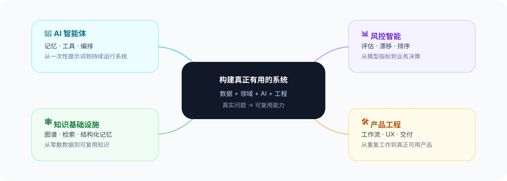

  <a href="./README.md">English</a> · <strong>中文</strong>

 

我拥有 **10+ 年金融风控、数据挖掘、大数据工程与全栈开发的一线实践经验**。这些经历也塑造了我今天做 AI 的方式：关注真实约束、可衡量的结果，以及能真正融入工作流的系统。

  
  
  
  
  
  

---

## 🧭 我在构建什么

我更关注 **Demo 之后的那一层**：记忆、评估、数据质量、决策逻辑、工作流设计，以及如何把 AI 真正工程化并落到实际使用中。

---

## ⚙️ 我的工作方式

**🔎 真实问题** → **🧪 原型** → **📊 数据与评估** → **🔁 工作流** → **🛠️ 产品** → **🧠 可复用系统**

 

| 原则 | 含义 |
| --- | --- |
| 🎯 **从真实问题出发** | 先解决真正重要的工作流或决策问题 |
| 📐 **先评估，再增加复杂度** | 在让系统变得更复杂之前，先定义证据和成功标准 |
| 🧠 **让 AI 做判断，让软件处理事实** | 确定性的逻辑保持确定性；把 AI 用在真正需要推理和语言能力的地方 |
